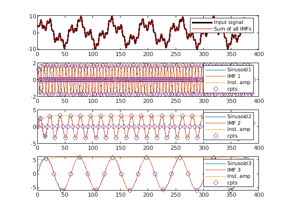
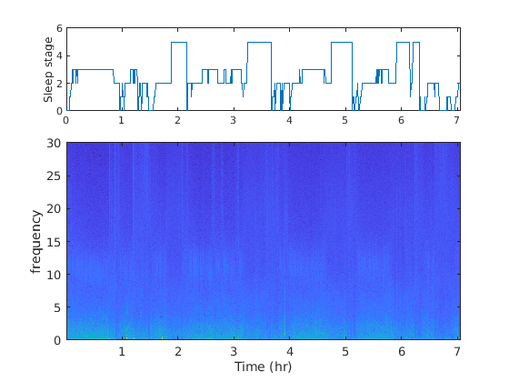
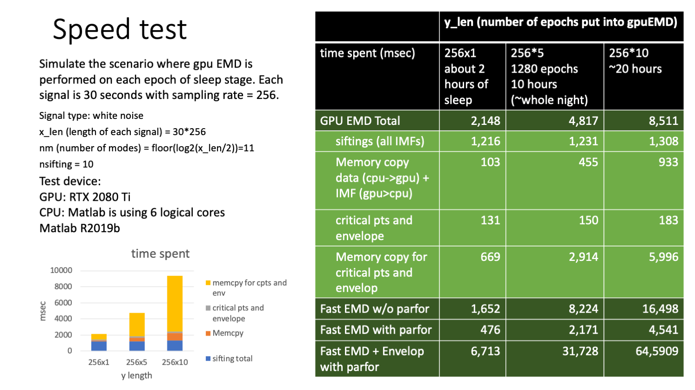

# Parallel EMD

This program performs parallele 1-D EMD (empirical model decomposition) on GPU, and returns the IMFs of each input, then, for each of the IMFs, the program also finds the upper evenlop, lower envelop, critical points (local maxima and local minina).

The 1-D signals with the same length (such as EEG signal for each sleep epoch) can be decomposed simultaneously, with each signal processed by each of the GPU kernal.


## Getting started :

   -  Clone this repository using the following git command : 
   -  

   -  In Matlab, compile the code with the following command 

```matlab:Code
addpath(genpath("./parallel-emd"))
mexcuda mex_gpuEMD_env.cu

```


## Requirements
 - NVIDIA
 - GXM
 - Matlab "parallel computing package" and XXX is required. For more information about mexcuda, please see [https://www.mathworks.com/help/parallel-computing/mexcuda.html](https://www.mathworks.com/help/parallel-computing/mexcuda.html)

## Using gpuEMD:

```matlab:Code
[out0,val0,idx0,len0,up0,low0] = mex_gpuEMD_env(A,nm, nsift);
```

  
### input:

(1) A: matrix (x_len by y_len), each column is the signal for 1-D EMD

(2) nm: number of modes desired

(3) nsift: number of sifting, please use 10. (will set as default in

futer version)

  
### output: 

(1) out0 (x_len*y_len*nm by 1): IMFs of all the input, need to reshape

(2) val0 (2*x_len*y_len*nm by 1): values of critical points of the IMFs

(3) idx0 (2*x_len*y_len*nm by 1): indexes of critical points of the IMFs

(4) len0 (y_len by nm ): number of critical points of the IMFs

(5) up0 (x_len*y_len*nm by 1): Upper envelop of all the IMFs, need to reshape

(6) low0 (x_len*y_len*nm by 1): Lower envelop of all the IMFs, need to reshape

  
# Examples
  

Two scripts are provided as examples for running gpuEMD.

### Example 1: decompose summation of 3 sinusoids with different frequencies (example1_gpuEMD_sinusoid.m)

In this example, the input is a summation of 3 sinusoids with different frequencies. We expect EMD to decompose the summation into single-tone sinusoids.  Note that this simple example is to validate the accuracy of parrallel EMD, not the efficiency. The signal is replicated for parrallel computing.

```matlab:Code
%% Generate signal

x_len = 390; y_len = 203; nm = 3; nsift = 10;
fs = 200;
t = (1:x_len)/fs;
x0 = zeros(x_len,nm);
for k = 1:nm
    f = 3.3^(nm+1-k);
    amp = (1.8)^(k);
    x0(:,k) = amp*sin(2*pi*f*t)';
end
x = sum(x0,2);
A = repmat(x,1,y_len); % replication
% plot the composite signal
fig1 = figure(); 
plot(t,A(:,1))
```

![./read_me_images/figure_0.png
)

```matlab:Code
%% Decompose by gpuEMD
[out0,val0,idx0,len0,up0,low0] = mex_gpuEMD_env(A,nm, nsift);
```

```text:Output
Number of IMF = 3
x_len value is 390, y_len is 203
Running parallele EMD on GPU .................................................
> GPU EMD completed
```

```matlab:Code
% Reshpe the output
% %the IMFs should be matrices with the same shape as A
out = reshape(out0, x_len, y_len, nm);
val = reshape(val0, x_len*2, y_len, nm);
idx = reshape(idx0, x_len*2, y_len, nm);
len = reshape(len0, y_len, nm);
up = reshape(up0, x_len, y_len, nm);
low = reshape(low0, x_len, y_len, nm);

```

```matlab:Code
%%
% plot the input and output
figure;
hold off;
subplot(nm+1,1,1);
plot(A(:,1),'k','LineWidth',2);
hold on;
plot(sum(out(:,1,:),3),'r','LineWidth',1);
legend('Input signal','Sum of all IMFs')
yi = 1;
for i = 1:nm
    subplot(nm+1,1,i+1);
    plot(x0(:,i),'DisplayName',['Sinusoid' num2str(i)]);
    hold on;
    plot(out(:,yi,i),'DisplayName',['IMF ' num2str(i)]);
    plot(up(:,yi,i),'DisplayName','Inst. amp');
    %plot(low(:,yi,i));
    plot(idx(1:len(yi,i),yi,i)+1,val(1:len(yi,i),yi,i),'o','DisplayName','cpts');
    legend()
end
```



  
# Example 2: decompose sleep epochs and calcualte time-frequency spectrogram

In this example, we cut the whole-night EEG into segments by epoch, decompose all of the epochs at once, and use the output to calcualte  "EMD" styled powerspectrum for each epoch. Then, combining all epochs, we derived the time-frequency representation of EEG by the "EMD" way.

### Reshape the whole night EEG


```matlab:Code
% Reshape the whole-night EEG
EEGA = buffer(EEG, epochL);
% Decompose by parallel EMD
nm = floor(log2(epochL/2));
nsift = 10;

[out0,val0,idx0,len0,up0,low0] = mex_gpuEMD_env(EEGA,nm, nsift);

% Reshape the output
% %the IMFs should be matrices with the same shape as A
x_len = epochL; y_len = size(EEGA,2); 
out = reshape(out0, x_len, y_len, nm);
val = reshape(val0, x_len*2, y_len, nm);
idx = reshape(idx0, x_len*2, y_len, nm);
len = reshape(len0, y_len, nm);
up = reshape(up0, x_len, y_len, nm);
low = reshape(low0, x_len, y_len, nm);

```

```matlab:Code
% Note that the second dimention (y_len) represents the epochs
% Then,with these criticle points and upper envelop, we can define
% power-spectrum the in EMD way
    % calculate insFreq
    InsFreq1 = instFreq3(criticalPoints, epochL, fs, len(iwin,:));
    [fscale,sPowerPlot,~] = freqPowerPlot3(InsFreq1, upperEnv);
% Finally, we plot the time-frequency spectrogram corresponding to sleep
% hypnogram
figure;
subplot(3,1,1); plot(time_hr, sleepscoring.stageNum(1:Nepoch));
xlim([0,time_hr(end)]);
ylabel('Sleep stage')
subplot(3,1,2:3); imagesc(time_hr,fscale,timePowerPlot(10:end,1:Nepoch).^0.25);
axis xy
ylim([0, 30])
ylabel('frequency'); xlabel('Time (hr)')
```



# Speed test

We tested the speed of parallel EMD on different number of signals (epochs), and compare the results with currently known most efficient EMD algorithm (fast EMD) by matlab built-in parallel computing with CPU.

Testing signals:
 - Type: White noise
 - x_len (length of each signal) = 30*256
 - nm (number of IMFs) = floor(log2(x_len/2)) = 11
 - nsifting (number of siftings) = 10

Testing environment:
 - GPU: RTX 2080 Ti
 - CPU: Intel(R) Xeon(R) Gold 6128 CPU @ 3.40 GHz
 - Number of logical cores for Matlab: 6
 - Matlab version: R2019b
  


(1) In GPU EMD, the sifting time is almost the same for different number of signals, this is true as they performs parrallely on all kernels.

(2) In GPU EMD, the most time-comsuming part (when the number of signals increases) is memory copy from GPU back to CPU, and this linearly increases with the number of signals.

(3) When performing only fast EMD without furhter calculating the envelop of the final IMF, the time spent is less than gpuEMD. However, this is due to the fact that gpuEMD spent too much time on copying the memory for critical points and envelopes back to CPU.

(4) When the time for calculating envelop is also considered, gpuEMD out-performs the fast EMD.

## Copy right (C):

(1) Lab of Integrated Biosignal Advances, National Central University; 2022

(2) Medical Biodynamics Program, Brigham and Women's Hospital, 


## Author
Orignal Authors: Li-Wen Chang, Men-Tzung Lo, Nasser Anssari, Ke-Hsin Hsu, Norden E. Huang, Wen-mei W. Hwu

Modifying Authors: Yu-Chi Peng, Hui-Wen Yang, Daniel Abadjiev, Jin-En Hsu, Yi-Je Lin, Kun Hu, Men-Tzung Lo

Please Cite: 

Li-Wen Chang, Men-Tzung Lo, Nasser Anssari, Ke-Hsin Hsu, Norden E. Huang, Wen-mei W. Hwu. "PARALLEL IMPLEMENTATION OF MULTI-DIMENSIONAL ENSEMBLE EMPIRICAL MODE DECOMPOSITION". IEEE International Conference on Acoustics, Speech and Signal Processing (ICASSP). IEEE, 2011.
